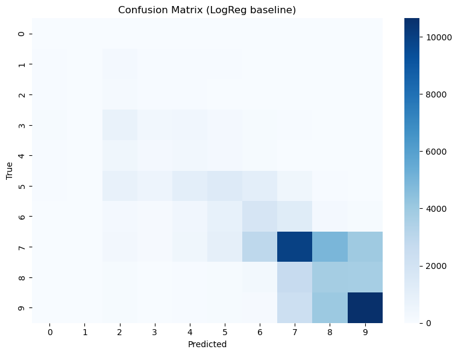

# ⭐ Review Rating Predictor (Text → Stars)

This project builds a machine learning system that predicts restaurant review ratings (0.5–5.0 stars) **directly from text**.  
It uses traditional NLP (TF-IDF + linear models) to establish a **strong, interpretable baseline** before moving toward transformer-based approaches.

---

## Project Overview

**Goal:**  
Predict the star rating (0.5–5.0) of a restaurant review given its text.

**Dataset:**  
Sorry I forgot where the dataset came from, but it containing columns such as:
- `reviewText` — the full review content  
- `reviewScoreOverall` — true star rating  
- Various restaurant and reviewer metadata (not used in baseline)

*(I will add the dataset if I find it agian in the future)*

---

## Current Baseline Setup

**Features:**
- TF-IDF (word bigrams + char trigrams–5-grams)
- Sublinear TF scaling, min_df=5, max_df=0.9  
- Combined with `FeatureUnion`

**Models:**
| Task | Model | Purpose |
|------|--------|----------|
| Regression | Ridge Regression (α=2.0) | Predict continuous rating (0–5) |
| Classification | Logistic Regression (SAGA, class_weight=balanced) | Predict discrete half-star bins |

**Hardware used:**  
Ryzen 5 5600X · RTX 3070 · 16 GB RAM · NVMe storage  
System: Arch Linux (Python 3.13, scikit-learn 1.5+)

---

## Baseline Results

| Metric | Ridge (Reg) | Logistic (Cls) |
|:--------|:-------------:|:---------------:|
| MAE | **0.384** | – |
| RMSE | **0.489** | – |
| Within ± 0.5 star | **0.894** | **0.792** |
| Accuracy | – | **0.425** |
| F1 macro | – | **0.250** |

**Training time:**  
- Ridge → ~2.7 min  
- Logistic (SAGA) → ~2 h 45 min (9842 s, converged at epoch 964)

**Confusion matrix:**  
Shows strong bias toward positive (7–9) ratings — typical for imbalanced review data.

**Basically:**

I want to improve this baseline as the next step in this project, but because of (relatively slow) hardware and still learning AI I haven't done it yet.

The run done for the stats here above wasn't fully completed because of a crash without saved data. So some extra stats will be added later.

---

## Roadmap

Basically polish the baseline a bit with logical small improvements and then continue to add a transformer pilot (fine-tune RoBERT, a Dutch BERT) for direct regression and add evalutation and such. This is basically just my first AI learning project for me and I still need to figure a lot out.

